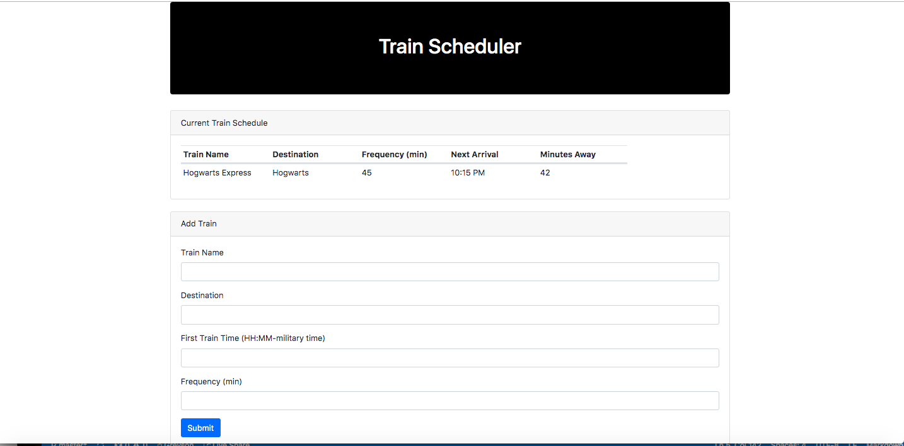

# TrainScheduler
Application that where users can input trains with various parameters and get organized info

## Project Description
Clean interface that uses a combination of firebase and moment js to iteratively provide users with real-time data regarding input train data

[The deployed version is accesible here](https://greysongy.github.io/TrainScheduler/)

)

### Technologies Used

html, css, javascript, jquery, bootstrap, firebase, moment.js

#### Additional Notes

The app is consistent across multiple users and stores all of their information
